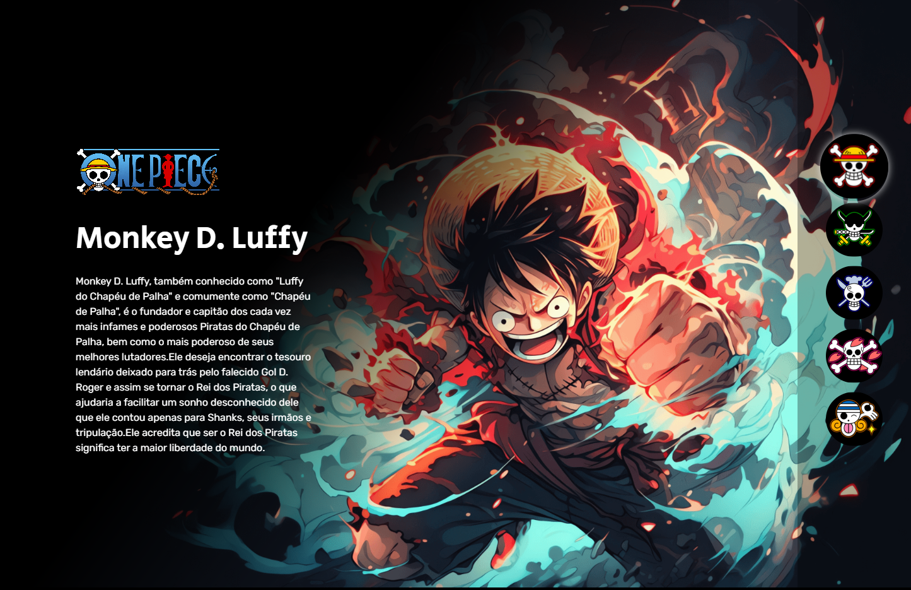

<h1 align="center"> ONE PIECE SELEÇÃO </h1>

  

## 🚀 Tecnologias

Esse projeto foi desenvolvido com as seguintes tecnologias:

- HTML
- CSS
- JavaScript
- Git e GitHub

## 💻 Projeto
Projeto desenvolvido durante a semana do zero ao programador contratado pelo canal [Dev em dobro](https://www.youtube.com/@DevemDobro), com o objetivo de introduzir o básico do desenvolvimento web utilizando HTML, CSS e JavaScript, o projeto possuí responsividade.